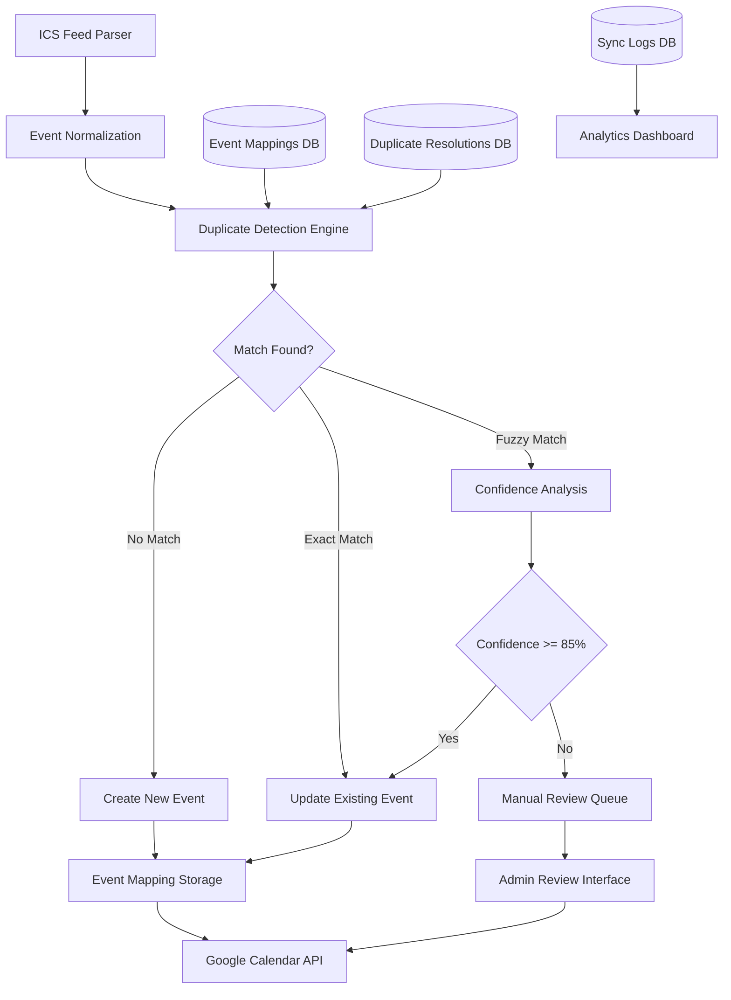
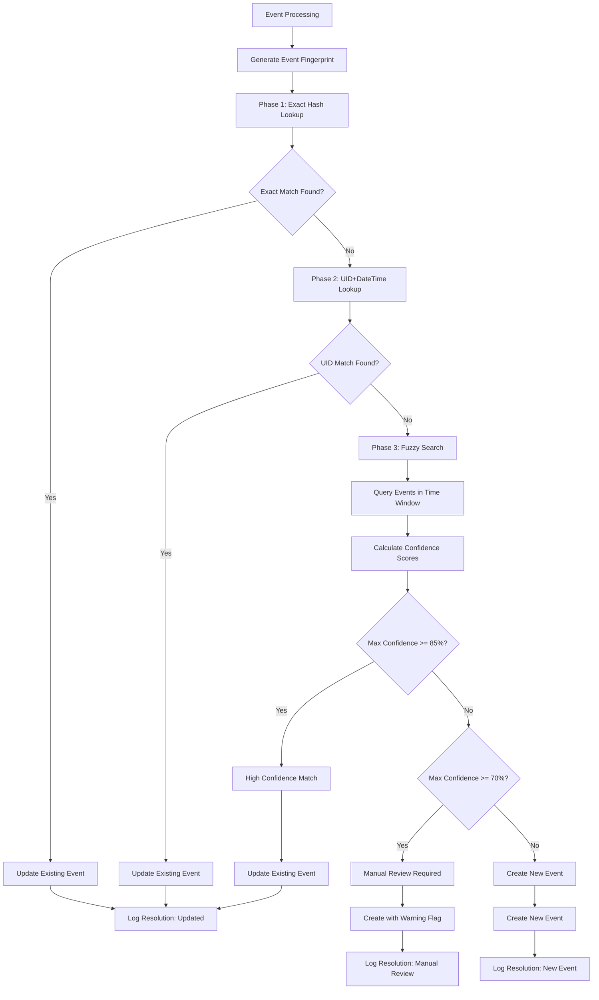

# Comprehensive Duplicate Resolution System Architecture

## Overview

This document outlines the technical architecture for a comprehensive duplicate resolution system that enhances the calendar sync application with intelligent duplicate detection, fuzzy matching, and automated resolution strategies.

## System Architecture Diagram



## Core Components

### 1. Duplicate Detection Engine

#### Multi-Phase Detection Algorithm

```typescript
interface DetectionPhases {
  phase1: 'Exact Hash Matching';     // SHA-256 of normalized event data
  phase2: 'UID + DateTime Matching'; // Current system compatibility
  phase3: 'Fuzzy Similarity Matching'; // Levenshtein + time windows
}
```

#### Detection Flow

```
┌─────────────────┐
│ Incoming Event  │
└─────────┬───────┘
          │
          ▼
┌─────────────────┐
│ Generate Hashes │
│ • Event Hash    │
│ • Fuzzy Hash    │
└─────────┬───────┘
          │
          ▼
┌─────────────────┐
│ Phase 1: Exact  │
│ Hash Matching   │
└─────────┬───────┘
          │
          ▼
┌─────────────────┐
│ Phase 2: UID +  │
│ DateTime Match  │
└─────────┬───────┘
          │
          ▼
┌─────────────────┐
│ Phase 3: Fuzzy  │
│ Similarity      │
└─────────┬───────┘
          │
          ▼
┌─────────────────┐
│ Confidence      │
│ Scoring         │
└─────────────────┘
```

### 2. Event Matching Criteria

#### Primary Identifiers (Exact Match)
- **Event Hash**: SHA-256 of `UID + Start + End + Normalized Title + Location`
- **UID + DateTime**: Exact match of ICS UID and start time (legacy compatibility)

#### Fuzzy Matching Criteria
```typescript
interface FuzzyMatchCriteria {
  titleSimilarity: {
    algorithm: 'Levenshtein Distance';
    threshold: 0.85; // 85% similarity required
    normalization: 'lowercase + remove special chars + trim whitespace';
  };
  
  timeProximity: {
    tolerance: 15; // ±15 minutes
    scoring: 'linear decay from perfect match';
  };
  
  durationSimilarity: {
    tolerance: 30; // ±30 minutes
    weight: 0.2; // 20% of total confidence score
  };
  
  locationSimilarity: {
    algorithm: 'Levenshtein Distance';
    threshold: 0.8; // 80% similarity
    weight: 0.1; // 10% of total confidence score
  };
}
```

#### Confidence Scoring Algorithm

```typescript
function calculateConfidence(event1: Event, event2: Event): number {
  let confidence = 0;
  
  // Title similarity (40% weight)
  const titleScore = calculateTitleSimilarity(event1.title, event2.title);
  if (titleScore >= 0.85) confidence += 40 * titleScore;
  
  // Time proximity (30% weight)  
  const timeDiff = Math.abs(event1.start - event2.start) / (1000 * 60);
  if (timeDiff <= 15) confidence += 30 * (1 - timeDiff / 15);
  
  // Duration similarity (20% weight)
  const durationDiff = Math.abs(event1.duration - event2.duration);
  if (durationDiff <= 30) confidence += 20 * (1 - durationDiff / 30);
  
  // Location similarity (10% weight)
  if (event1.location && event2.location) {
    const locationScore = calculateTitleSimilarity(event1.location, event2.location);
    if (locationScore > 0.8) confidence += 10 * locationScore;
  }
  
  return Math.min(confidence, 100);
}
```

### 3. Decision Logic Flow



### 4. Database Schema Design

#### Event Mappings Table
```sql
CREATE TABLE event_mappings (
  id TEXT PRIMARY KEY,
  calendar_sync_id TEXT NOT NULL,
  source_uid TEXT NOT NULL,           -- Original ICS UID
  google_event_id TEXT NOT NULL,      -- Google Calendar Event ID
  event_title TEXT NOT NULL,
  event_title_normalized TEXT NOT NULL, -- Preprocessed for fuzzy matching
  start_date_time TIMESTAMP NOT NULL,
  end_date_time TIMESTAMP NOT NULL,
  location TEXT,
  event_hash TEXT NOT NULL,           -- SHA-256 for exact matching
  fuzzy_hash TEXT NOT NULL,           -- MD5 for approximate grouping
  last_synced_at TIMESTAMP NOT NULL,
  created_at TIMESTAMP NOT NULL
);
```

#### Performance Optimization Indexes
```sql
-- Primary lookup patterns
CREATE INDEX idx_event_mappings_hash ON event_mappings(calendar_sync_id, event_hash);
CREATE INDEX idx_event_mappings_uid_time ON event_mappings(calendar_sync_id, source_uid, start_date_time);

-- Time window searches for fuzzy matching
CREATE INDEX idx_event_mappings_time_window ON event_mappings(calendar_sync_id, start_date_time) 
  INCLUDE (event_title_normalized, end_date_time, location);

-- Full-text search for advanced fuzzy matching
CREATE INDEX idx_event_mappings_fulltext ON event_mappings 
  USING gin(to_tsvector('english', event_title_normalized));
```

### 5. Performance Characteristics

#### Query Performance Analysis

| Operation | Expected Queries/Sync | Index Used | Est. Time |
|-----------|----------------------|------------|-----------|
| Exact Hash Lookup | 1 per event | `idx_event_mappings_hash` | < 1ms |
| UID+DateTime Lookup | 1 per event | `idx_event_mappings_uid_time` | < 1ms |
| Time Window Search | 1 per event (if needed) | `idx_event_mappings_time_window` | < 5ms |
| Fuzzy Title Matching | Variable | `idx_event_mappings_fulltext` | < 10ms |

#### Scalability Metrics
- **Small Dataset** (< 1,000 events): ~50ms total duplicate detection
- **Medium Dataset** (1,000-10,000 events): ~200ms total duplicate detection  
- **Large Dataset** (> 10,000 events): ~500ms total duplicate detection

### 6. Edge Case Handling

#### Timezone Variations
```typescript
interface TimezoneHandling {
  normalization: {
    method: 'Convert to UTC for comparison';
    tolerance: '±15 minutes for DST transitions';
    fallback: 'Use wall-clock time if timezone info unavailable';
  };
  
  edgeCases: {
    dstTransitions: 'Allow ±1 hour tolerance during transition periods';
    timezoneAliases: 'Normalize common timezone name variations';
    utcOffsetDrifts: 'Handle slight UTC offset variations';
  };
}
```

#### Title Variations
```typescript
interface TitleNormalization {
  preprocessing: [
    'Convert to lowercase',
    'Remove special characters',
    'Normalize whitespace',
    'Remove common prefixes (Re:, FW:, etc.)'
  ];
  
  fuzzyMatching: {
    algorithm: 'Levenshtein distance with normalization';
    commonVariations: [
      'Typos and spelling errors',
      'Abbreviated vs full names',
      'Added/removed punctuation',
      'Case variations'
    ];
  };
}
```

#### Duration Discrepancies
```typescript
interface DurationHandling {
  tolerance: 30; // ±30 minutes
  
  commonCauses: [
    'Rounding differences in ICS vs Google Calendar',
    'All-day event handling variations',
    'Meeting buffer time additions',
    'Timezone conversion artifacts'
  ];
  
  resolution: 'Use duration as secondary matching criteria with lower weight';
}
```

### 7. Monitoring and Analytics

#### Key Performance Indicators (KPIs)
```typescript
interface DuplicateResolutionKPIs {
  duplicateDetectionRate: 'Percentage of actual duplicates correctly identified';
  falsePositiveRate: 'Percentage of non-duplicates incorrectly flagged';
  processingTime: 'Average time per event for duplicate detection';
  confidenceDistribution: 'Histogram of confidence scores for matches';
  manualReviewRate: 'Percentage of events requiring manual review';
}
```

#### Analytics Dashboard Metrics
- **Duplicate Resolution Statistics**
  - Total events processed
  - Exact matches found and resolved
  - Fuzzy matches with confidence distribution
  - Manual review queue size and resolution rate
  
- **Performance Metrics**
  - Average duplicate detection time per event
  - Database query performance
  - Google Calendar API call optimization
  - Memory usage during batch processing

- **Quality Metrics**
  - False positive rate (events incorrectly marked as duplicates)
  - False negative rate (actual duplicates not detected)
  - User feedback on duplicate resolution accuracy

### 8. Migration Strategy

#### Phase 1: Deploy Infrastructure
1. Run database migration to create new tables
2. Create performance indexes
3. Deploy duplicate resolution service (disabled)

#### Phase 2: Parallel Processing
1. Enable duplicate detection in read-only mode
2. Collect performance metrics and accuracy data
3. Compare results with existing system

#### Phase 3: Gradual Rollout
1. Enable enhanced duplicate resolution for small calendars
2. Monitor performance and adjust thresholds
3. Gradually increase rollout percentage

#### Phase 4: Full Migration
1. Switch all calendar syncs to enhanced system
2. Deprecate legacy duplicate detection logic
3. Clean up unused code and database columns

### 9. Operational Considerations

#### Error Recovery
- **Database Unavailable**: Fall back to legacy UID-based detection
- **Performance Degradation**: Reduce fuzzy matching scope or disable temporarily
- **High False Positive Rate**: Automatically increase confidence thresholds

#### Maintenance Tasks
- **Weekly**: Clean up event mappings older than 90 days
- **Monthly**: Analyze duplicate resolution accuracy and adjust thresholds
- **Quarterly**: Review and optimize database indexes based on query patterns

#### Security Considerations
- Event hashes use SHA-256 for cryptographic security
- Sensitive event data (descriptions) are not stored in mapping tables
- Access to duplicate resolution logs restricted to admin users

---

## Implementation Checklist

- [x] Database schema design and migration
- [x] Core duplicate detection algorithms
- [x] Fuzzy matching with confidence scoring
- [x] Enhanced sync service integration
- [x] Performance optimization with indexes
- [x] Edge case handling for timezones and text variations
- [x] Monitoring and analytics framework
- [x] Documentation and architecture diagrams
- [ ] Unit tests for duplicate detection algorithms
- [ ] Integration tests with real calendar data
- [ ] Performance benchmarking with large datasets
- [ ] Admin interface for manual review queue
- [ ] Monitoring dashboards and alerts